# Pegasus Frontend 主题截图画廊

把 [pegasus-theme-gallery-db](https://github.com/mmatyas/pegasus-theme-gallery-db) 里 **全部 71 个 Pegasus 前端主题**的截图直接铺在 README 里，打开即可预览，不用一个个点进仓库。

- 主题总数：**71**（成功取到截图 **64**）
- 图片来源：各主题仓库的 `.meta/screenshots/`、`README.md` 引用图或常见预览图
- 最近更新：2026-09-27 15:03 UTC

> 截图版权归各主题作者所有，这里仅作预览展示。点击图片可跳转到原仓库。

## 目录

<p>
[Amberline](https://github.com/ZagonAb/Amberline) · @ZagonAb · [amiga workbench](https://github.com/LeeBigelow/pegasus-theme-amiga-workbench) · @LeeBigelow · [Anbernic Theme](https://github.com/ZagonAb/Anbernic-Theme) · @ZagonAb · [bartopOS v1.0](https://github.com/r3tro80/bartopOS) · @r3tro80 · [Clean Covers](https://github.com/mlumeau/pegasus-theme-clean-covers) · @mlumeau · [Clean Covers Desktop](https://github.com/mlumeau/pegasus-theme-clean-covers-desktop) · @mlumeau · [clearOS v1.1](https://github.com/PlayingKarrde/clearOS) · @PlayingKarrde · [Collection Hub](https://github.com/ZagonAb/Collection-Hub) · @ZagonAb · [COLORFUL](https://github.com/RobZombie9043/COLORFUL) · @RobZombie9043 · [ColorShader](https://github.com/ZagonAb/ColorShader) · @ZagonAb · [EasyLaunch](https://github.com/VGmove/EasyLaunch) · @VGmove · [Epic Memories](https://github.com/FrenchGithubUser/epic-memories-theme) · @FrenchGithubUser · [ES-DE Slate theme for Pegasus](https://github.com/nicjansma/pegasus-theme-slate-es-de) · @nicjansma · [ES2 Simple theme for Pegasus](https://github.com/mmatyas/pegasus-theme-es2-simple) · @mmatyas · [Famicom Beach theme for Pegasus](https://github.com/mmatyas/pegasus-theme-9999999-in-1) · @mmatyas · [Flat Ozone](https://github.com/ZagonAb/Flat-Ozone) · @ZagonAb · [FlatFlix](https://github.com/ZagonAb/FlatFlix) · @ZagonAb · [Flixnet theme for Pegasus](https://github.com/basvroegop/RetroidFlix) · @basvroegop · [Flixnet theme for Pegasus](https://github.com/mmatyas/pegasus-theme-flixnet) · @mmatyas · [gameOS - Fire v1.0](https://github.com/jimbob4000/gameOS) · @jimbob4000 · [gameOS fire sKye](https://github.com/HomeStarRunnerTron/gameOS-fire-sKye) · @HomeStarRunnerTron · [gameOS v1.10](https://github.com/PlayingKarrde/gameOS) · @PlayingKarrde · [Grid Micro theme for Pegasus](https://github.com/mmatyas/pegasus-theme-grid-micro) · @mmatyas · [Grid theme for Pegasus](https://github.com/mmatyas/pegasus-theme-grid) · @mmatyas · [library](https://github.com/Fr75s/library) · @Fr75s · [Ludens](https://github.com/ZagonAb/Ludens-Pegasus) · @ZagonAb · [Minimis](https://github.com/waldnercharles/Minimis) · @waldnercharles · [neoretrō v0.131](https://github.com/valsou/neoretro) · @valsou · [New Pegasus Experience Theme](https://github.com/riquenunes/pegasus-theme-npe) · @riquenunes · [Nostalgia-Grid theme for Pegasus](https://github.com/ZagonAb/Nostalgia-Grid) · @ZagonAb · [PEGASUS BEACON LITE](https://github.com/ZagonAb/pegasus-beacon-lite) · @ZagonAb · [pegasus box](https://github.com/ZagonAb/pegasus-box) · @ZagonAb · [Pegasus Boy Lite](https://github.com/thomas0465/PegasusBoyLite) · @thomas0465 · [Pegasus Grid theme for Retroid Pocket 2](https://github.com/DFOXpro/rp2-pegasus-theme-grid) · @DFOXpro · [pegasus-theme-genre-filter](https://github.com/flagrant99/pegasus-theme-genre-filter) · @flagrant99 · [pegasus-theme-gpiOS](https://github.com/SinisterSpatula/pegasus-theme-gpiOS) · @SinisterSpatula · [Pegasus-theme-XrossMediaBar](https://github.com/Lx-Dm/Pegasus-theme-XrossMediaBar) · @Lx-Dm · [PlayHub](https://github.com/ZagonAb/PlayHub) · @ZagonAb · [Polystation theme for Pegasus](https://github.com/carloslmar/pegasus-theme-9999999-in-1-poly) · @carloslmar · [prosperoOS v0.1](https://github.com/PlayingKarrde/prosperoOS) · @PlayingKarrde · [RefiOS (a fork of Flixnet)](https://github.com/eleo95/pegasus-theme-refiOS) · @eleo95 · [Reprise](https://github.com/ilyasturki/pegasus-theme-reprise) · @ilyasturki · [Retro Mega Neo](https://github.com/hazem-abdelghani/retromega-neo) · @hazem-abdelghani · [Retro Mega Next](https://github.com/plaidman/retromega-next) · @plaidman · [Retro Mega v0.4](https://github.com/djfumberger/retromega) · @djfumberger · [Retroid Pocket RG351 Theme](https://github.com/dragoonDorise/RP-RG351) · @dragoonDorise · [Retroid Pocket Switch Theme](https://github.com/dragoonDorise/RP-Switch) · @dragoonDorise · [RetroidStation](https://github.com/basvroegop/RetroidStation) · @basvroegop · [Revolution Menu](https://github.com/travrei/revolutionmenu) · @travrei · [Run&Game](https://github.com/ZagonAb/Run-Game) · @ZagonAb · [Secretary theme for Pegasus](https://github.com/mmatyas/pegasus-theme-secretary) · @mmatyas · [shinretro](https://github.com/TigraTT-Driver/shinretro) · @TigraTT-Driver · [skylineOS](https://github.com/Gheovgos/skylineOS2) · @Gheovgos · [skylineOS](https://github.com/RBertoCases/skylineOS) · @RBertoCases · [skylineOS++](https://github.com/ismaelestalayo/skylineOSP) · @ismaelestalayo · [slatest](https://github.com/LeeBigelow/pegasus-theme-slatest) · @LeeBigelow · [Slick theme for Pegasus](https://github.com/buzz/pegasus-theme-slick) · @buzz · [struceOS-Pegasus-Theme](https://github.com/my-name-is-p/struceOS-Pegasus-Theme) · @my-name-is-p · [switchOS v0.3](https://github.com/PlayingKarrde/switchOS) · @PlayingKarrde · [The Homage v0.2.0](https://github.com/asdfgasfhsn/pegasus-theme-homage) · @asdfgasfhsn · [Vapour Pegasus](https://github.com/ZagonAb/Vapour-Pegasus) · @ZagonAb · [VideoGame](https://github.com/ZagonAb/VideoGame) · @ZagonAb · [XboxOS (a fork of gameOS)](https://github.com/alfredolvera/XboxOS) · @alfredolvera · [XboxOSv2 (a fork of a fork of gameOS)](https://github.com/luxureousproductions-bit/XboxOSv2) · @luxureousproductions-bit
</p>

## 截图预览

<table>
  <tr>
    <td align="center" valign="top" width="33%">
      <a href="https://github.com/alfredolvera/XboxOS"></a>
      <br><br>
      <b><a href="https://github.com/alfredolvera/XboxOS">XboxOS (a fork of gameOS)</a></b><br>
      <sub>@alfredolvera</sub>
    </td>
    <td align="center" valign="top" width="33%">
      <a href="https://github.com/asdfgasfhsn/pegasus-theme-homage">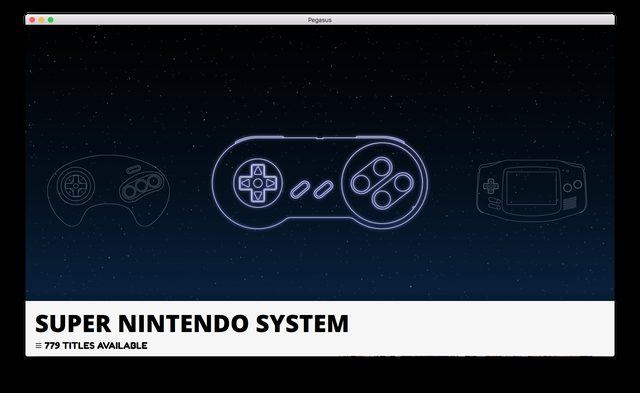</a>
      <br><br>
      <b><a href="https://github.com/asdfgasfhsn/pegasus-theme-homage">The Homage v0.2.0</a></b><br>
      <sub>@asdfgasfhsn</sub>
    </td>
    <td align="center" valign="top" width="33%">
      <a href="https://github.com/basvroegop/RetroidFlix">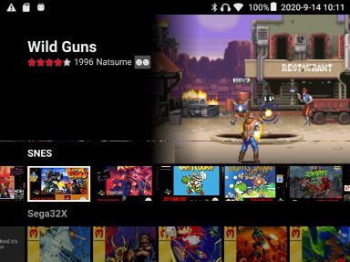</a>
      <br><br>
      <b><a href="https://github.com/basvroegop/RetroidFlix">Flixnet theme for Pegasus</a></b><br>
      <sub>@basvroegop</sub>
    </td>
  </tr>
  <tr>
    <td align="center" valign="top" width="33%">
      <a href="https://github.com/basvroegop/RetroidStation">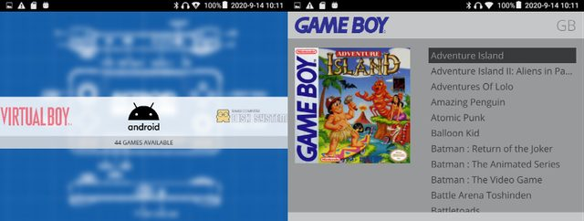</a>
      <br><br>
      <b><a href="https://github.com/basvroegop/RetroidStation">RetroidStation</a></b><br>
      <sub>@basvroegop</sub>
    </td>
    <td align="center" valign="top" width="33%">
      <a href="https://github.com/buzz/pegasus-theme-slick">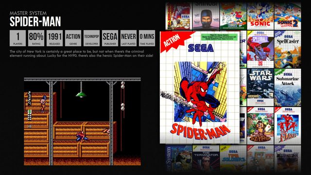</a>
      <br><br>
      <b><a href="https://github.com/buzz/pegasus-theme-slick">Slick theme for Pegasus</a></b><br>
      <sub>@buzz</sub>
    </td>
    <td align="center" valign="top" width="33%">
      <a href="https://github.com/carloslmar/pegasus-theme-9999999-in-1-poly">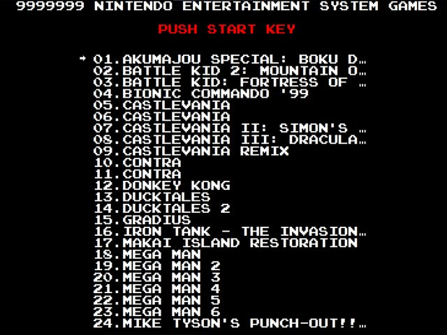</a>
      <br><br>
      <b><a href="https://github.com/carloslmar/pegasus-theme-9999999-in-1-poly">Polystation theme for Pegasus</a></b><br>
      <sub>@carloslmar</sub>
    </td>
  </tr>
  <tr>
    <td align="center" valign="top" width="33%">
      <a href="https://github.com/DFOXpro/rp2-pegasus-theme-grid">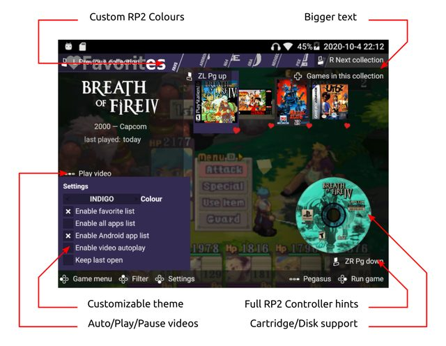</a>
      <br><br>
      <b><a href="https://github.com/DFOXpro/rp2-pegasus-theme-grid">Pegasus Grid theme for Retroid Pocket 2</a></b><br>
      <sub>@DFOXpro</sub>
    </td>
    <td align="center" valign="top" width="33%">
      <a href="https://github.com/djfumberger/retromega">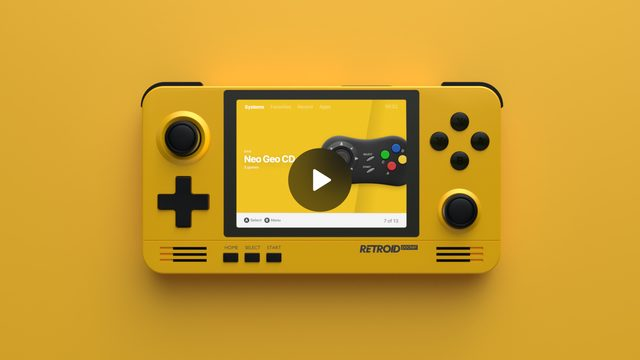</a>
      <br><br>
      <b><a href="https://github.com/djfumberger/retromega">Retro Mega v0.4</a></b><br>
      <sub>@djfumberger</sub>
    </td>
    <td align="center" valign="top" width="33%">
      <a href="https://github.com/dragoonDorise/RP-RG351">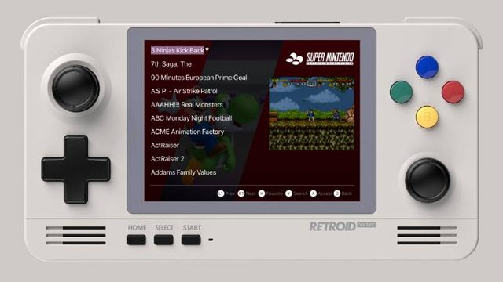</a>
      <br><br>
      <b><a href="https://github.com/dragoonDorise/RP-RG351">Retroid Pocket RG351 Theme</a></b><br>
      <sub>@dragoonDorise</sub>
    </td>
  </tr>
  <tr>
    <td align="center" valign="top" width="33%">
      <a href="https://github.com/dragoonDorise/RP-Switch">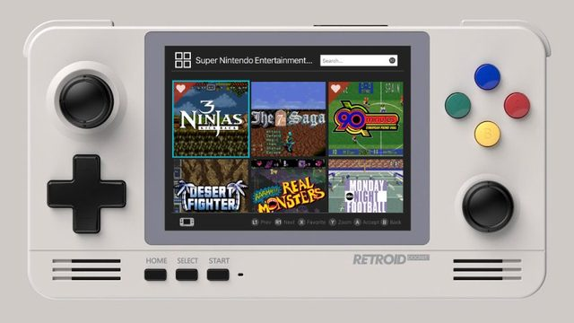</a>
      <br><br>
      <b><a href="https://github.com/dragoonDorise/RP-Switch">Retroid Pocket Switch Theme</a></b><br>
      <sub>@dragoonDorise</sub>
    </td>
    <td align="center" valign="top" width="33%">
      <a href="https://github.com/eleo95/pegasus-theme-refiOS">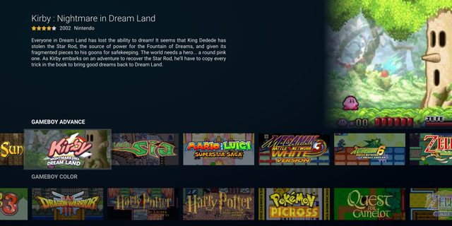</a>
      <br><br>
      <b><a href="https://github.com/eleo95/pegasus-theme-refiOS">RefiOS (a fork of Flixnet)</a></b><br>
      <sub>@eleo95</sub>
    </td>
    <td align="center" valign="top" width="33%">
      <a href="https://github.com/flagrant99/pegasus-theme-genre-filter">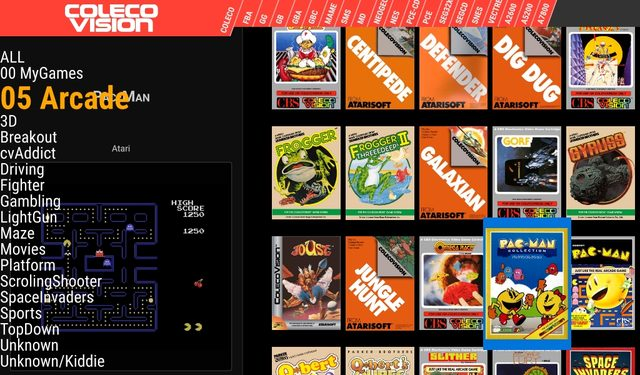</a>
      <br><br>
      <b><a href="https://github.com/flagrant99/pegasus-theme-genre-filter">pegasus-theme-genre-filter</a></b><br>
      <sub>@flagrant99</sub>
    </td>
  </tr>
  <tr>
    <td align="center" valign="top" width="33%">
      <a href="https://github.com/Fr75s/library">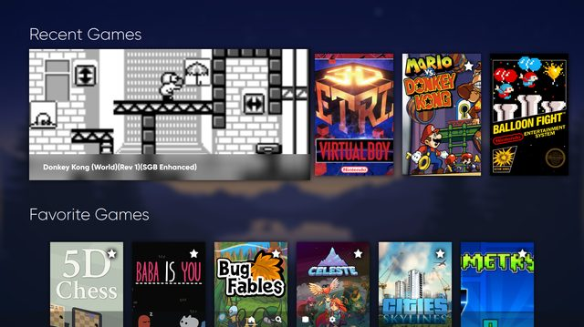</a>
      <br><br>
      <b><a href="https://github.com/Fr75s/library">library</a></b><br>
      <sub>@Fr75s</sub>
    </td>
    <td align="center" valign="top" width="33%">
      <a href="https://github.com/FrenchGithubUser/epic-memories-theme">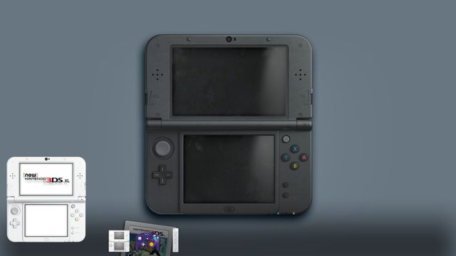</a>
      <br><br>
      <b><a href="https://github.com/FrenchGithubUser/epic-memories-theme">Epic Memories</a></b><br>
      <sub>@FrenchGithubUser</sub>
    </td>
    <td align="center" valign="top" width="33%">
      <a href="https://github.com/Gheovgos/skylineOS2">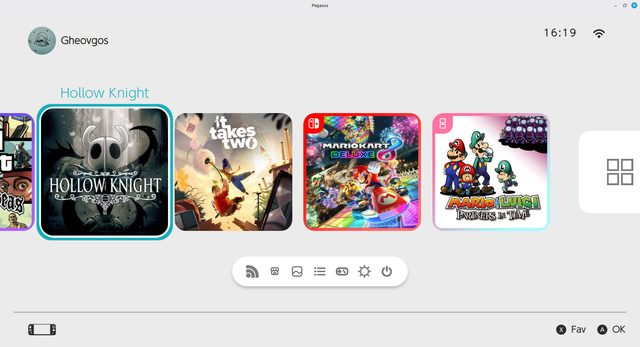</a>
      <br><br>
      <b><a href="https://github.com/Gheovgos/skylineOS2">skylineOS</a></b><br>
      <sub>@Gheovgos</sub>
    </td>
  </tr>
  <tr>
    <td align="center" valign="top" width="33%">
      <a href="https://github.com/hazem-abdelghani/retromega-neo">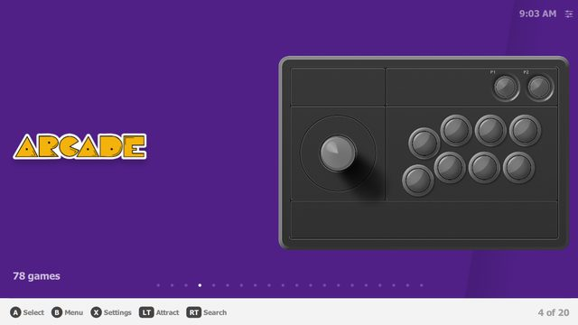</a>
      <br><br>
      <b><a href="https://github.com/hazem-abdelghani/retromega-neo">Retro Mega Neo</a></b><br>
      <sub>@hazem-abdelghani</sub>
    </td>
    <td align="center" valign="top" width="33%">
      <a href="https://github.com/HomeStarRunnerTron/gameOS-fire-sKye"></a>
      <br><br>
      <b><a href="https://github.com/HomeStarRunnerTron/gameOS-fire-sKye">gameOS fire sKye</a></b><br>
      <sub>@HomeStarRunnerTron</sub>
    </td>
    <td align="center" valign="top" width="33%">
      <a href="https://github.com/ilyasturki/pegasus-theme-reprise">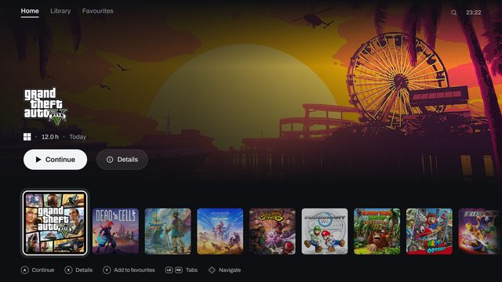</a>
      <br><br>
      <b><a href="https://github.com/ilyasturki/pegasus-theme-reprise">Reprise</a></b><br>
      <sub>@ilyasturki</sub>
    </td>
  </tr>
  <tr>
    <td align="center" valign="top" width="33%">
      <a href="https://github.com/ismaelestalayo/skylineOSP">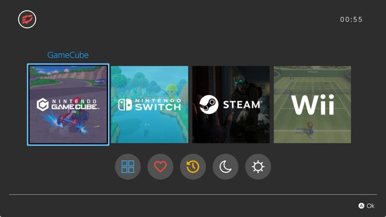</a>
      <br><br>
      <b><a href="https://github.com/ismaelestalayo/skylineOSP">skylineOS++</a></b><br>
      <sub>@ismaelestalayo</sub>
    </td>
    <td align="center" valign="top" width="33%">
      <a href="https://github.com/jimbob4000/gameOS"></a>
      <br><br>
      <b><a href="https://github.com/jimbob4000/gameOS">gameOS - Fire v1.0</a></b><br>
      <sub>@jimbob4000</sub>
    </td>
    <td align="center" valign="top" width="33%">
      <a href="https://github.com/LeeBigelow/pegasus-theme-amiga-workbench">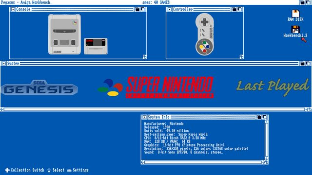</a>
      <br><br>
      <b><a href="https://github.com/LeeBigelow/pegasus-theme-amiga-workbench">amiga workbench</a></b><br>
      <sub>@LeeBigelow</sub>
    </td>
  </tr>
  <tr>
    <td align="center" valign="top" width="33%">
      <a href="https://github.com/LeeBigelow/pegasus-theme-slatest">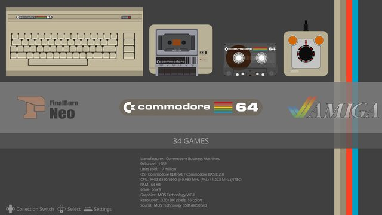</a>
      <br><br>
      <b><a href="https://github.com/LeeBigelow/pegasus-theme-slatest">slatest</a></b><br>
      <sub>@LeeBigelow</sub>
    </td>
    <td align="center" valign="top" width="33%">
      <a href="https://github.com/luxureousproductions-bit/XboxOSv2"></a>
      <br><br>
      <b><a href="https://github.com/luxureousproductions-bit/XboxOSv2">XboxOSv2 (a fork of a fork of gameOS)</a></b><br>
      <sub>@luxureousproductions-bit</sub>
    </td>
    <td align="center" valign="top" width="33%">
      <a href="https://github.com/Lx-Dm/Pegasus-theme-XrossMediaBar">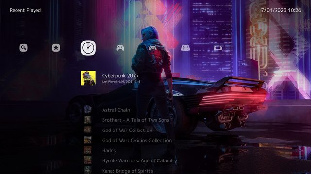</a>
      <br><br>
      <b><a href="https://github.com/Lx-Dm/Pegasus-theme-XrossMediaBar">Pegasus-theme-XrossMediaBar</a></b><br>
      <sub>@Lx-Dm</sub>
    </td>
  </tr>
  <tr>
    <td align="center" valign="top" width="33%">
      <a href="https://github.com/mlumeau/pegasus-theme-clean-covers">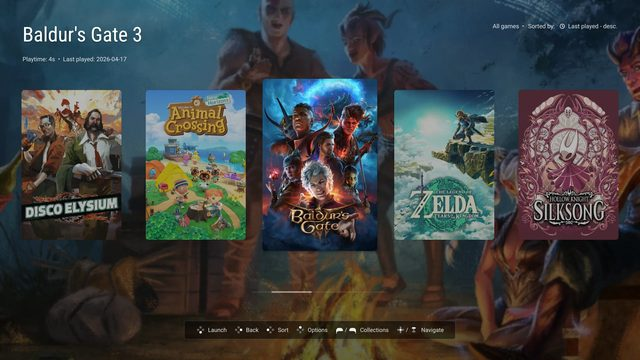</a>
      <br><br>
      <b><a href="https://github.com/mlumeau/pegasus-theme-clean-covers">Clean Covers</a></b><br>
      <sub>@mlumeau</sub>
    </td>
    <td align="center" valign="top" width="33%">
      <a href="https://github.com/mlumeau/pegasus-theme-clean-covers-desktop">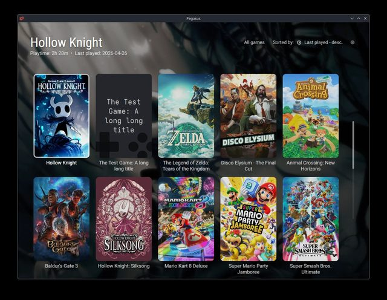</a>
      <br><br>
      <b><a href="https://github.com/mlumeau/pegasus-theme-clean-covers-desktop">Clean Covers Desktop</a></b><br>
      <sub>@mlumeau</sub>
    </td>
    <td align="center" valign="top" width="33%">
      <a href="https://github.com/mmatyas/pegasus-theme-9999999-in-1">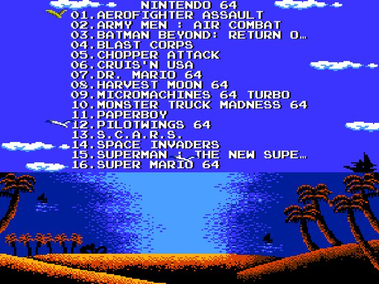</a>
      <br><br>
      <b><a href="https://github.com/mmatyas/pegasus-theme-9999999-in-1">Famicom Beach theme for Pegasus</a></b><br>
      <sub>@mmatyas</sub>
    </td>
  </tr>
  <tr>
    <td align="center" valign="top" width="33%">
      <a href="https://github.com/mmatyas/pegasus-theme-es2-simple">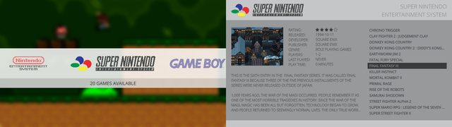</a>
      <br><br>
      <b><a href="https://github.com/mmatyas/pegasus-theme-es2-simple">ES2 Simple theme for Pegasus</a></b><br>
      <sub>@mmatyas</sub>
    </td>
    <td align="center" valign="top" width="33%">
      <a href="https://github.com/mmatyas/pegasus-theme-flixnet">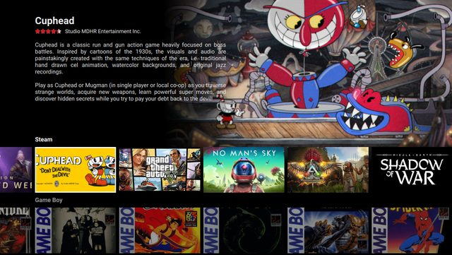</a>
      <br><br>
      <b><a href="https://github.com/mmatyas/pegasus-theme-flixnet">Flixnet theme for Pegasus</a></b><br>
      <sub>@mmatyas</sub>
    </td>
    <td align="center" valign="top" width="33%">
      <a href="https://github.com/mmatyas/pegasus-theme-grid">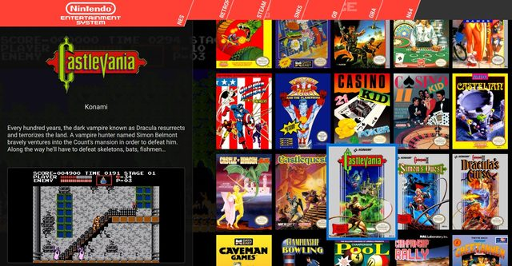</a>
      <br><br>
      <b><a href="https://github.com/mmatyas/pegasus-theme-grid">Grid theme for Pegasus</a></b><br>
      <sub>@mmatyas</sub>
    </td>
  </tr>
  <tr>
    <td align="center" valign="top" width="33%">
      <a href="https://github.com/mmatyas/pegasus-theme-grid-micro">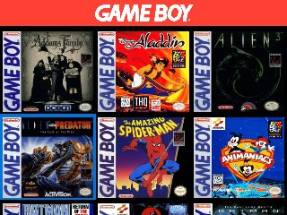</a>
      <br><br>
      <b><a href="https://github.com/mmatyas/pegasus-theme-grid-micro">Grid Micro theme for Pegasus</a></b><br>
      <sub>@mmatyas</sub>
    </td>
    <td align="center" valign="top" width="33%">
      <a href="https://github.com/mmatyas/pegasus-theme-secretary">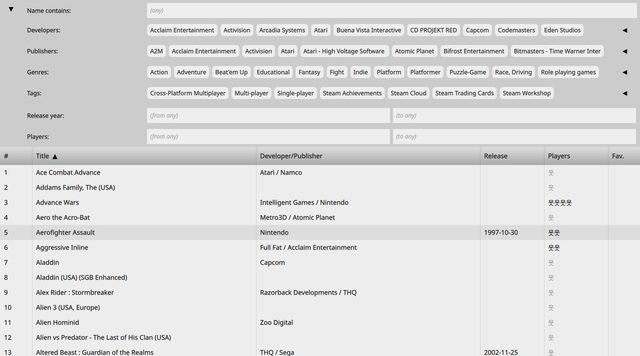</a>
      <br><br>
      <b><a href="https://github.com/mmatyas/pegasus-theme-secretary">Secretary theme for Pegasus</a></b><br>
      <sub>@mmatyas</sub>
    </td>
    <td align="center" valign="top" width="33%">
      <a href="https://github.com/my-name-is-p/struceOS-Pegasus-Theme">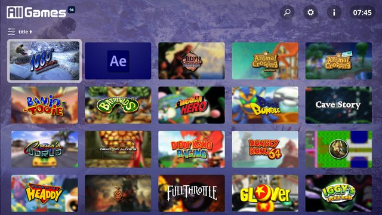</a>
      <br><br>
      <b><a href="https://github.com/my-name-is-p/struceOS-Pegasus-Theme">struceOS-Pegasus-Theme</a></b><br>
      <sub>@my-name-is-p</sub>
    </td>
  </tr>
  <tr>
    <td align="center" valign="top" width="33%">
      <a href="https://github.com/nicjansma/pegasus-theme-slate-es-de">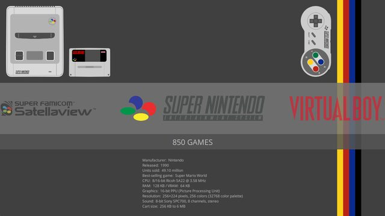</a>
      <br><br>
      <b><a href="https://github.com/nicjansma/pegasus-theme-slate-es-de">ES-DE Slate theme for Pegasus</a></b><br>
      <sub>@nicjansma</sub>
    </td>
    <td align="center" valign="top" width="33%">
      <a href="https://github.com/plaidman/retromega-next">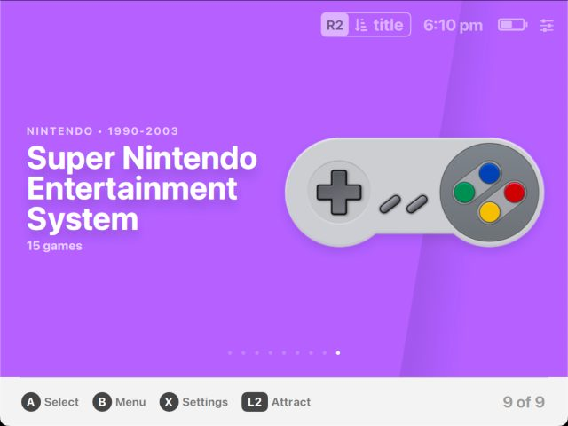</a>
      <br><br>
      <b><a href="https://github.com/plaidman/retromega-next">Retro Mega Next</a></b><br>
      <sub>@plaidman</sub>
    </td>
    <td align="center" valign="top" width="33%">
      <a href="https://github.com/PlayingKarrde/clearOS"></a>
      <br><br>
      <b><a href="https://github.com/PlayingKarrde/clearOS">clearOS v1.1</a></b><br>
      <sub>@PlayingKarrde</sub>
    </td>
  </tr>
  <tr>
    <td align="center" valign="top" width="33%">
      <a href="https://github.com/PlayingKarrde/gameOS"></a>
      <br><br>
      <b><a href="https://github.com/PlayingKarrde/gameOS">gameOS v1.10</a></b><br>
      <sub>@PlayingKarrde</sub>
    </td>
    <td align="center" valign="top" width="33%">
      <a href="https://github.com/PlayingKarrde/prosperoOS"></a>
      <br><br>
      <b><a href="https://github.com/PlayingKarrde/prosperoOS">prosperoOS v0.1</a></b><br>
      <sub>@PlayingKarrde</sub>
    </td>
    <td align="center" valign="top" width="33%">
      <a href="https://github.com/PlayingKarrde/switchOS"></a>
      <br><br>
      <b><a href="https://github.com/PlayingKarrde/switchOS">switchOS v0.3</a></b><br>
      <sub>@PlayingKarrde</sub>
    </td>
  </tr>
  <tr>
    <td align="center" valign="top" width="33%">
      <a href="https://github.com/r3tro80/bartopOS"></a>
      <br><br>
      <b><a href="https://github.com/r3tro80/bartopOS">bartopOS v1.0</a></b><br>
      <sub>@r3tro80</sub>
    </td>
    <td align="center" valign="top" width="33%">
      <a href="https://github.com/RBertoCases/skylineOS">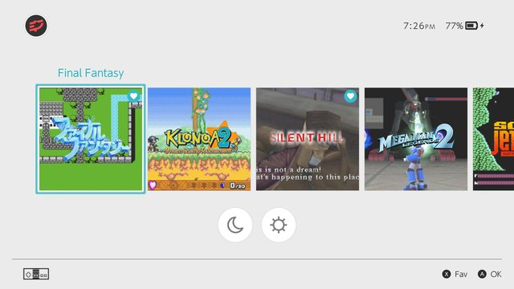</a>
      <br><br>
      <b><a href="https://github.com/RBertoCases/skylineOS">skylineOS</a></b><br>
      <sub>@RBertoCases</sub>
    </td>
    <td align="center" valign="top" width="33%">
      <a href="https://github.com/riquenunes/pegasus-theme-npe">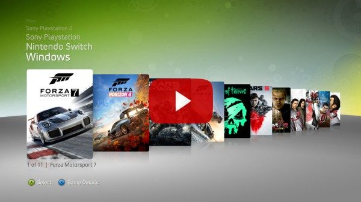</a>
      <br><br>
      <b><a href="https://github.com/riquenunes/pegasus-theme-npe">New Pegasus Experience Theme</a></b><br>
      <sub>@riquenunes</sub>
    </td>
  </tr>
  <tr>
    <td align="center" valign="top" width="33%">
      <a href="https://github.com/RobZombie9043/COLORFUL">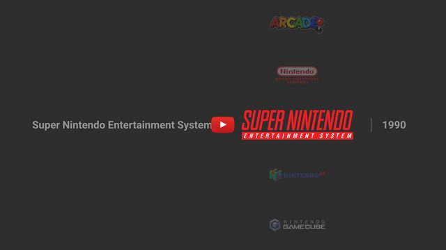</a>
      <br><br>
      <b><a href="https://github.com/RobZombie9043/COLORFUL">COLORFUL</a></b><br>
      <sub>@RobZombie9043</sub>
    </td>
    <td align="center" valign="top" width="33%">
      <a href="https://github.com/SinisterSpatula/pegasus-theme-gpiOS"></a>
      <br><br>
      <b><a href="https://github.com/SinisterSpatula/pegasus-theme-gpiOS">pegasus-theme-gpiOS</a></b><br>
      <sub>@SinisterSpatula</sub>
    </td>
    <td align="center" valign="top" width="33%">
      <a href="https://github.com/thomas0465/PegasusBoyLite">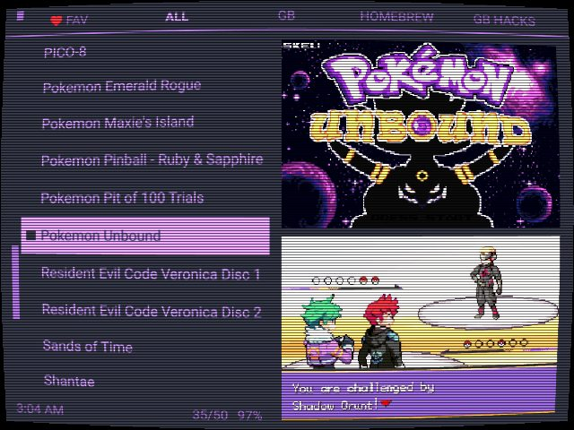</a>
      <br><br>
      <b><a href="https://github.com/thomas0465/PegasusBoyLite">Pegasus Boy Lite</a></b><br>
      <sub>@thomas0465</sub>
    </td>
  </tr>
  <tr>
    <td align="center" valign="top" width="33%">
      <a href="https://github.com/TigraTT-Driver/shinretro"></a>
      <br><br>
      <b><a href="https://github.com/TigraTT-Driver/shinretro">shinretro</a></b><br>
      <sub>@TigraTT-Driver</sub>
    </td>
    <td align="center" valign="top" width="33%">
      <a href="https://github.com/travrei/revolutionmenu">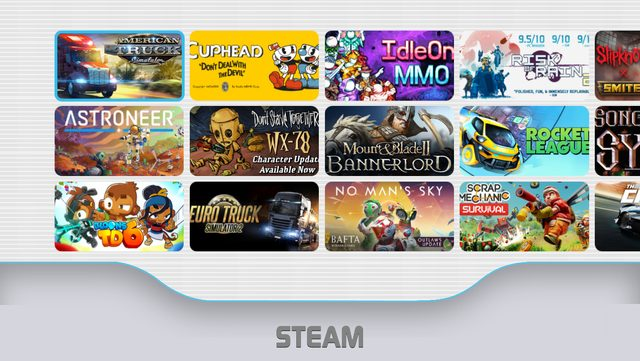</a>
      <br><br>
      <b><a href="https://github.com/travrei/revolutionmenu">Revolution Menu</a></b><br>
      <sub>@travrei</sub>
    </td>
    <td align="center" valign="top" width="33%">
      <a href="https://github.com/valsou/neoretro"></a>
      <br><br>
      <b><a href="https://github.com/valsou/neoretro">neoretrō v0.131</a></b><br>
      <sub>@valsou</sub>
    </td>
  </tr>
  <tr>
    <td align="center" valign="top" width="33%">
      <a href="https://github.com/VGmove/EasyLaunch">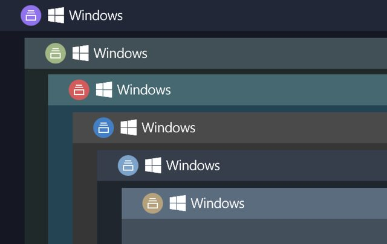</a>
      <br><br>
      <b><a href="https://github.com/VGmove/EasyLaunch">EasyLaunch</a></b><br>
      <sub>@VGmove</sub>
    </td>
    <td align="center" valign="top" width="33%">
      <a href="https://github.com/waldnercharles/Minimis">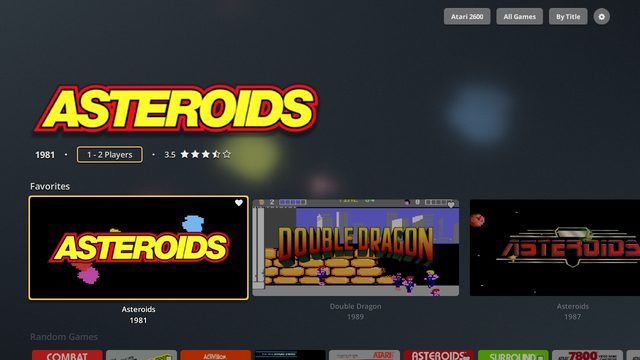</a>
      <br><br>
      <b><a href="https://github.com/waldnercharles/Minimis">Minimis</a></b><br>
      <sub>@waldnercharles</sub>
    </td>
    <td align="center" valign="top" width="33%">
      <a href="https://github.com/ZagonAb/Amberline">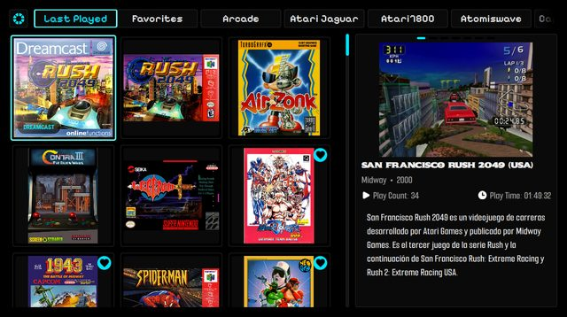</a>
      <br><br>
      <b><a href="https://github.com/ZagonAb/Amberline">Amberline</a></b><br>
      <sub>@ZagonAb</sub>
    </td>
  </tr>
  <tr>
    <td align="center" valign="top" width="33%">
      <a href="https://github.com/ZagonAb/Anbernic-Theme">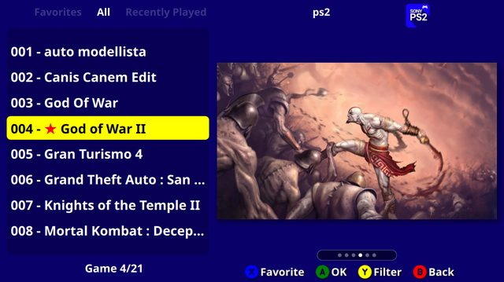</a>
      <br><br>
      <b><a href="https://github.com/ZagonAb/Anbernic-Theme">Anbernic Theme</a></b><br>
      <sub>@ZagonAb</sub>
    </td>
    <td align="center" valign="top" width="33%">
      <a href="https://github.com/ZagonAb/Collection-Hub">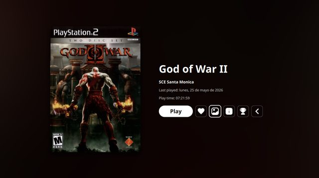</a>
      <br><br>
      <b><a href="https://github.com/ZagonAb/Collection-Hub">Collection Hub</a></b><br>
      <sub>@ZagonAb</sub>
    </td>
    <td align="center" valign="top" width="33%">
      <a href="https://github.com/ZagonAb/ColorShader">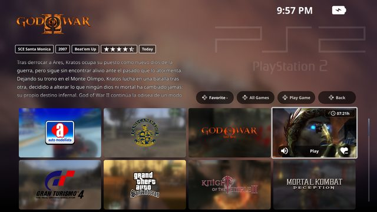</a>
      <br><br>
      <b><a href="https://github.com/ZagonAb/ColorShader">ColorShader</a></b><br>
      <sub>@ZagonAb</sub>
    </td>
  </tr>
  <tr>
    <td align="center" valign="top" width="33%">
      <a href="https://github.com/ZagonAb/Flat-Ozone">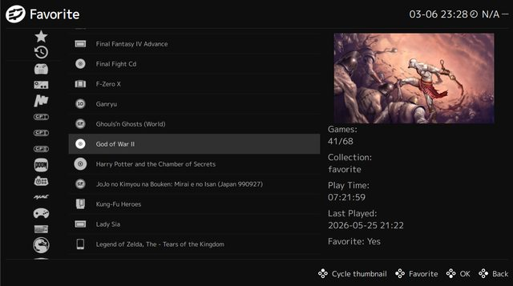</a>
      <br><br>
      <b><a href="https://github.com/ZagonAb/Flat-Ozone">Flat Ozone</a></b><br>
      <sub>@ZagonAb</sub>
    </td>
    <td align="center" valign="top" width="33%">
      <a href="https://github.com/ZagonAb/FlatFlix">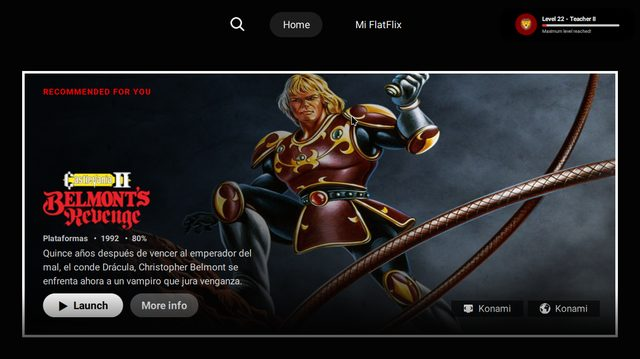</a>
      <br><br>
      <b><a href="https://github.com/ZagonAb/FlatFlix">FlatFlix</a></b><br>
      <sub>@ZagonAb</sub>
    </td>
    <td align="center" valign="top" width="33%">
      <a href="https://github.com/ZagonAb/Ludens-Pegasus">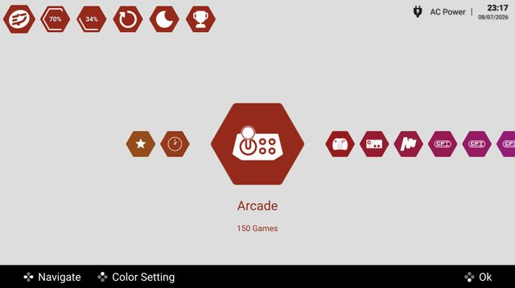</a>
      <br><br>
      <b><a href="https://github.com/ZagonAb/Ludens-Pegasus">Ludens</a></b><br>
      <sub>@ZagonAb</sub>
    </td>
  </tr>
  <tr>
    <td align="center" valign="top" width="33%">
      <a href="https://github.com/ZagonAb/Nostalgia-Grid">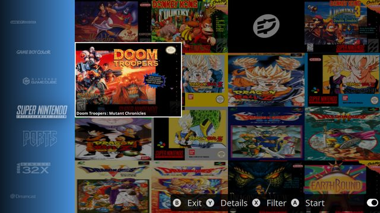</a>
      <br><br>
      <b><a href="https://github.com/ZagonAb/Nostalgia-Grid">Nostalgia-Grid theme for Pegasus</a></b><br>
      <sub>@ZagonAb</sub>
    </td>
    <td align="center" valign="top" width="33%">
      <a href="https://github.com/ZagonAb/pegasus-beacon-lite">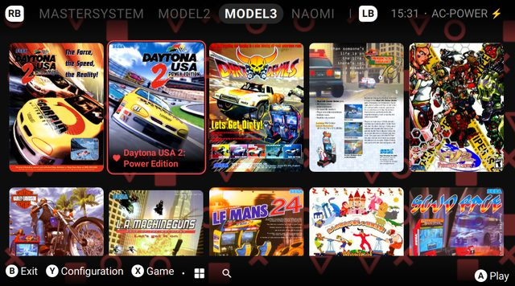</a>
      <br><br>
      <b><a href="https://github.com/ZagonAb/pegasus-beacon-lite">PEGASUS BEACON LITE</a></b><br>
      <sub>@ZagonAb</sub>
    </td>
    <td align="center" valign="top" width="33%">
      <a href="https://github.com/ZagonAb/pegasus-box">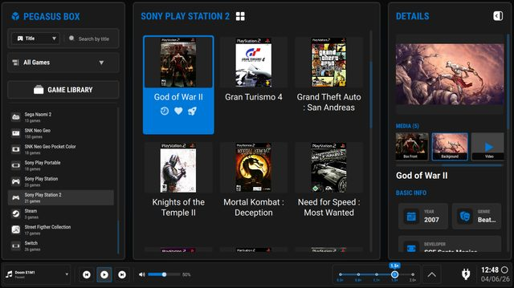</a>
      <br><br>
      <b><a href="https://github.com/ZagonAb/pegasus-box">pegasus box</a></b><br>
      <sub>@ZagonAb</sub>
    </td>
  </tr>
  <tr>
    <td align="center" valign="top" width="33%">
      <a href="https://github.com/ZagonAb/PlayHub">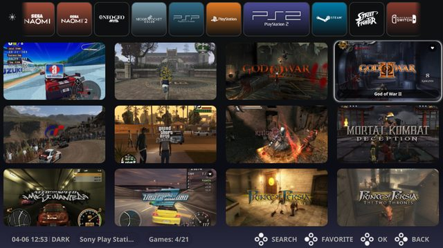</a>
      <br><br>
      <b><a href="https://github.com/ZagonAb/PlayHub">PlayHub</a></b><br>
      <sub>@ZagonAb</sub>
    </td>
    <td align="center" valign="top" width="33%">
      <a href="https://github.com/ZagonAb/Run-Game">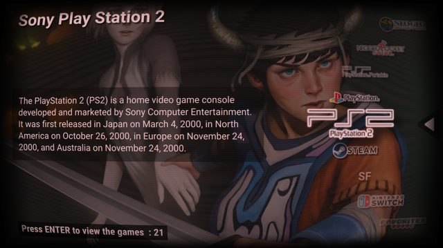</a>
      <br><br>
      <b><a href="https://github.com/ZagonAb/Run-Game">Run&Game</a></b><br>
      <sub>@ZagonAb</sub>
    </td>
    <td align="center" valign="top" width="33%">
      <a href="https://github.com/ZagonAb/Vapour-Pegasus">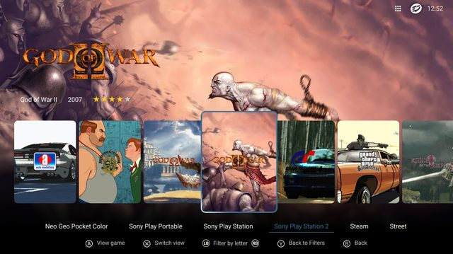</a>
      <br><br>
      <b><a href="https://github.com/ZagonAb/Vapour-Pegasus">Vapour Pegasus</a></b><br>
      <sub>@ZagonAb</sub>
    </td>
  </tr>
  <tr>
    <td align="center" valign="top" width="33%">
      <a href="https://github.com/ZagonAb/VideoGame">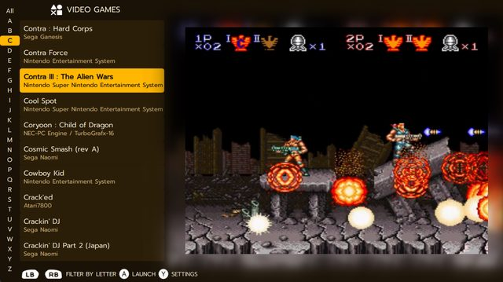</a>
      <br><br>
      <b><a href="https://github.com/ZagonAb/VideoGame">VideoGame</a></b><br>
      <sub>@ZagonAb</sub>
    </td>
    <td width="33%"></td>
    <td width="33%"></td>
  </tr>
</table>

## 更多截图

<details><summary><b>XboxOS (a fork of gameOS)</b> (@alfredolvera) — 3 张</summary>

<p>
  
  
  
</p>

</details>

<details><summary><b>The Homage v0.2.0</b> (@asdfgasfhsn) — 2 张</summary>

<p>
  
  
</p>

</details>

<details><summary><b>Slick theme for Pegasus</b> (@buzz) — 2 张</summary>

<p>
  
  
</p>

</details>

<details><summary><b>Retroid Pocket RG351 Theme</b> (@dragoonDorise) — 2 张</summary>

<p>
  
  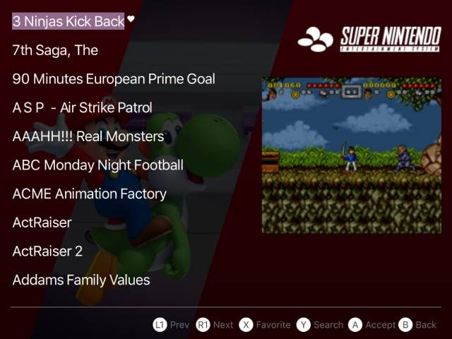
</p>

</details>

<details><summary><b>Retroid Pocket Switch Theme</b> (@dragoonDorise) — 2 张</summary>

<p>
  
  
</p>

</details>

<details><summary><b>pegasus-theme-genre-filter</b> (@flagrant99) — 3 张</summary>

<p>
  
  
  
</p>

</details>

<details><summary><b>library</b> (@Fr75s) — 3 张</summary>

<p>
  
  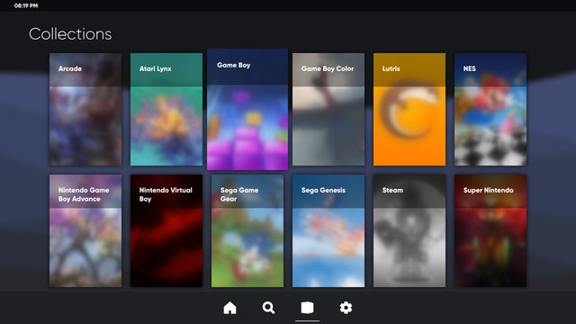
  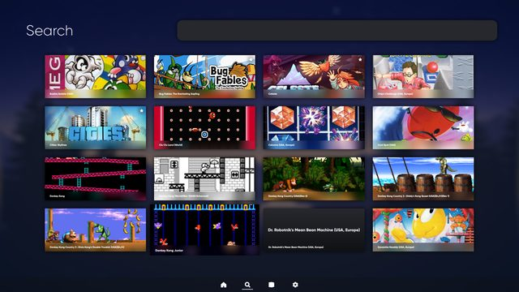
</p>

</details>

<details><summary><b>Epic Memories</b> (@FrenchGithubUser) — 3 张</summary>

<p>
  
  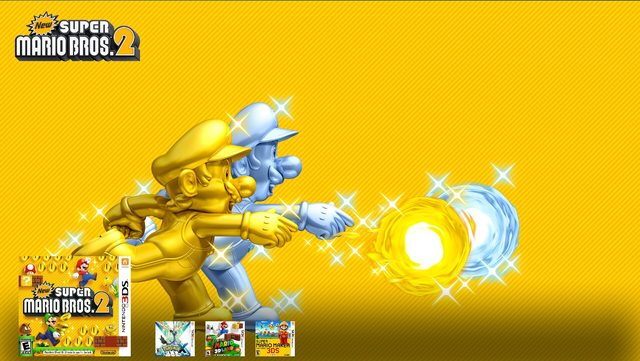
  
</p>

</details>

<details><summary><b>skylineOS</b> (@Gheovgos) — 3 张</summary>

<p>
  
  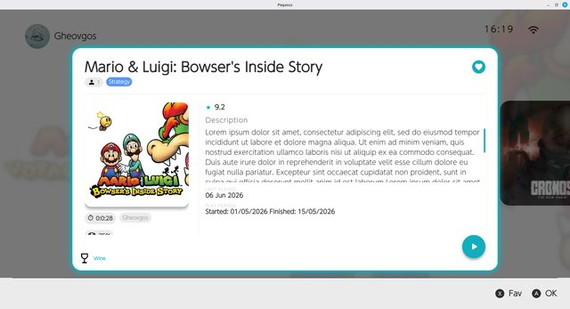
  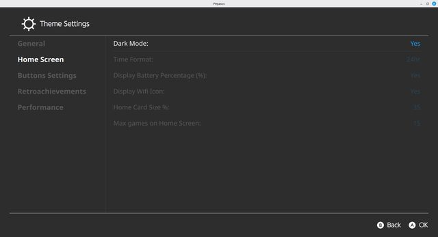
</p>

</details>

<details><summary><b>Retro Mega Neo</b> (@hazem-abdelghani) — 3 张</summary>

<p>
  
  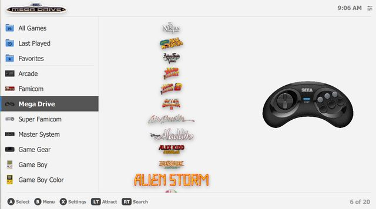
  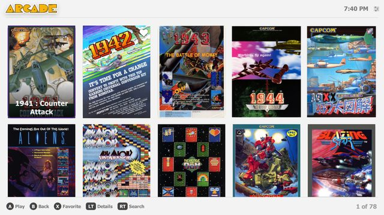
</p>

</details>

<details><summary><b>gameOS fire sKye</b> (@HomeStarRunnerTron) — 3 张</summary>

<p>
  
  
  
</p>

</details>

<details><summary><b>Reprise</b> (@ilyasturki) — 3 张</summary>

<p>
  
  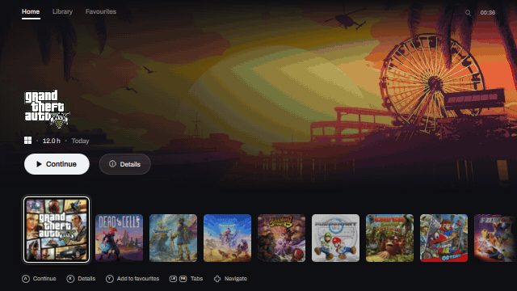
  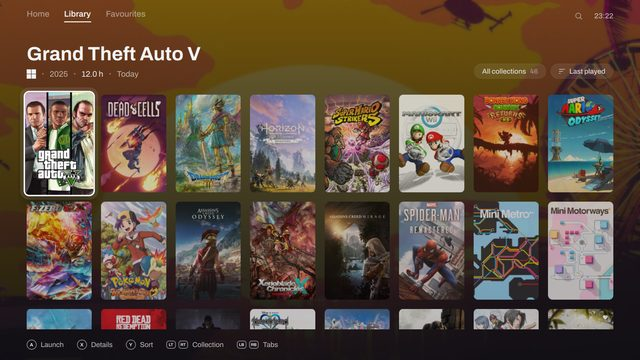
</p>

</details>

<details><summary><b>skylineOS++</b> (@ismaelestalayo) — 3 张</summary>

<p>
  
  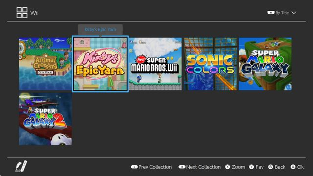
  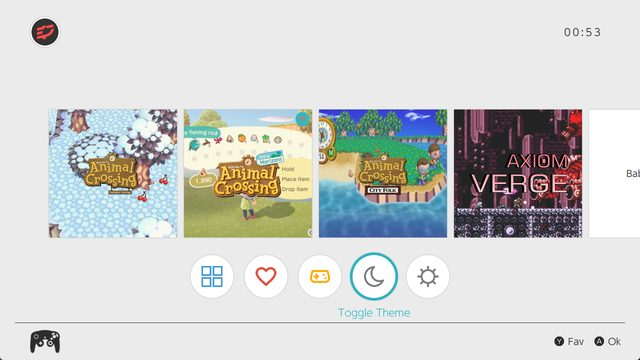
</p>

</details>

<details><summary><b>gameOS - Fire v1.0</b> (@jimbob4000) — 3 张</summary>

<p>
  
  
  
</p>

</details>

<details><summary><b>amiga workbench</b> (@LeeBigelow) — 2 张</summary>

<p>
  
  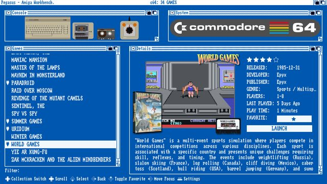
</p>

</details>

<details><summary><b>slatest</b> (@LeeBigelow) — 3 张</summary>

<p>
  
  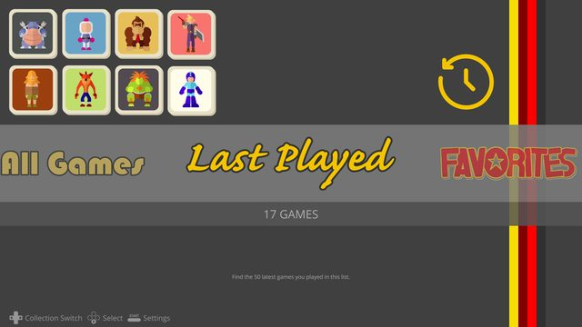
  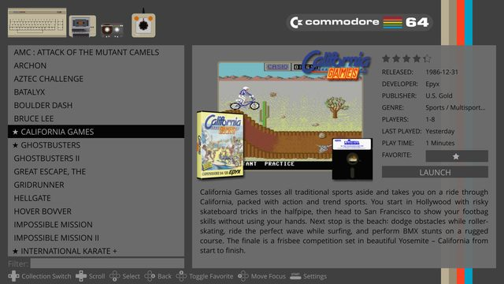
</p>

</details>

<details><summary><b>XboxOSv2 (a fork of a fork of gameOS)</b> (@luxureousproductions-bit) — 3 张</summary>

<p>
  
  
  
</p>

</details>

<details><summary><b>Clean Covers</b> (@mlumeau) — 3 张</summary>

<p>
  
  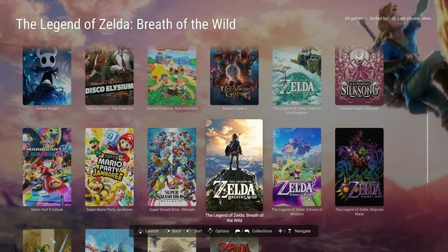
  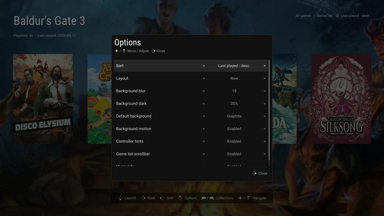
</p>

</details>

<details><summary><b>Clean Covers Desktop</b> (@mlumeau) — 3 张</summary>

<p>
  
  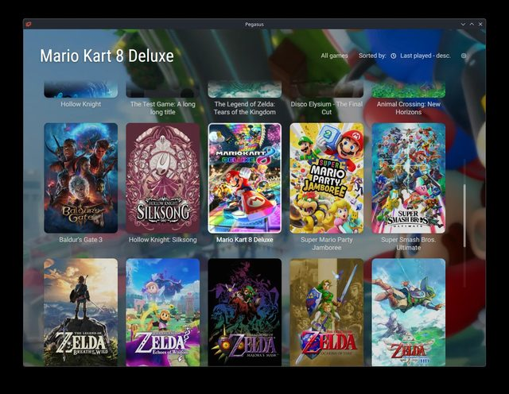
  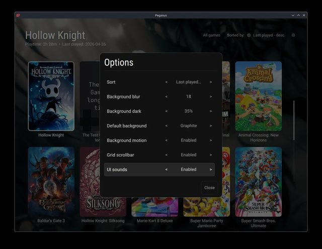
</p>

</details>

<details><summary><b>Grid Micro theme for Pegasus</b> (@mmatyas) — 2 张</summary>

<p>
  
  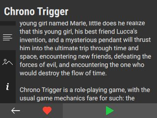
</p>

</details>

<details><summary><b>struceOS-Pegasus-Theme</b> (@my-name-is-p) — 3 张</summary>

<p>
  
  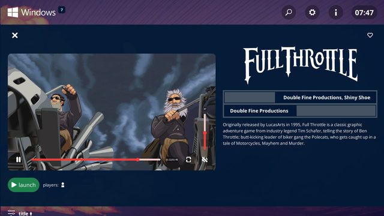
  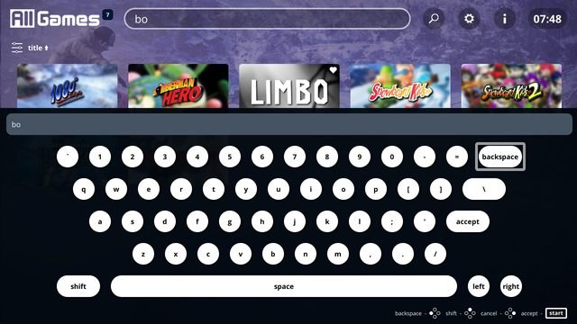
</p>

</details>

<details><summary><b>Retro Mega Next</b> (@plaidman) — 3 张</summary>

<p>
  
  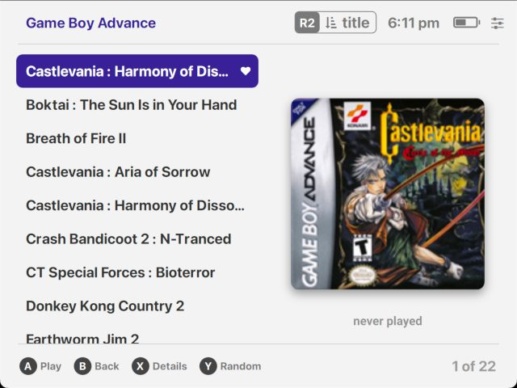
  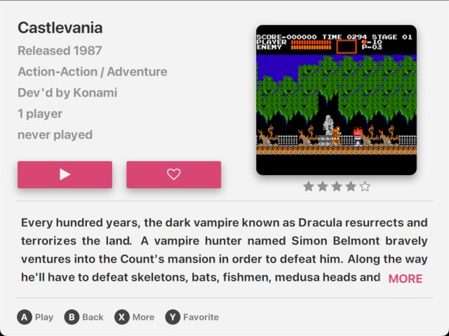
</p>

</details>

<details><summary><b>clearOS v1.1</b> (@PlayingKarrde) — 3 张</summary>

<p>
  
  
  
</p>

</details>

<details><summary><b>prosperoOS v0.1</b> (@PlayingKarrde) — 3 张</summary>

<p>
  
  
  
</p>

</details>

<details><summary><b>switchOS v0.3</b> (@PlayingKarrde) — 2 张</summary>

<p>
  
  
</p>

</details>

<details><summary><b>bartopOS v1.0</b> (@r3tro80) — 3 张</summary>

<p>
  
  
  
</p>

</details>

<details><summary><b>skylineOS</b> (@RBertoCases) — 3 张</summary>

<p>
  
  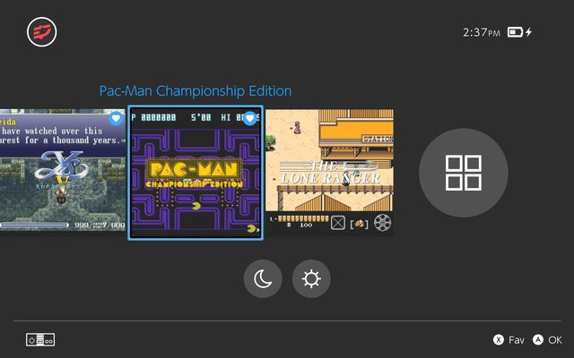
  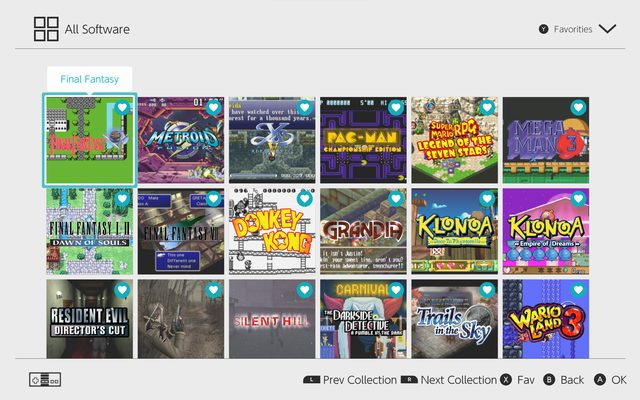
</p>

</details>

<details><summary><b>COLORFUL</b> (@RobZombie9043) — 3 张</summary>

<p>
  
  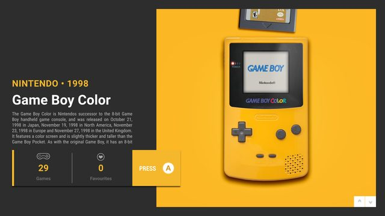
  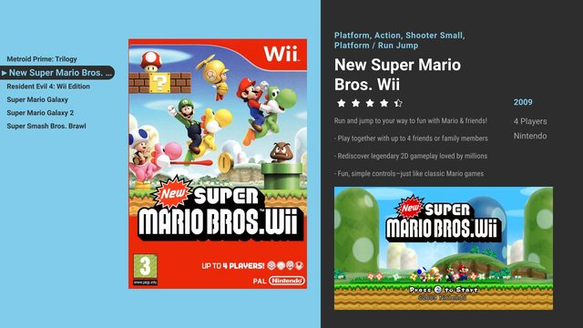
</p>

</details>

<details><summary><b>pegasus-theme-gpiOS</b> (@SinisterSpatula) — 3 张</summary>

<p>
  
  
  
</p>

</details>

<details><summary><b>Pegasus Boy Lite</b> (@thomas0465) — 3 张</summary>

<p>
  
  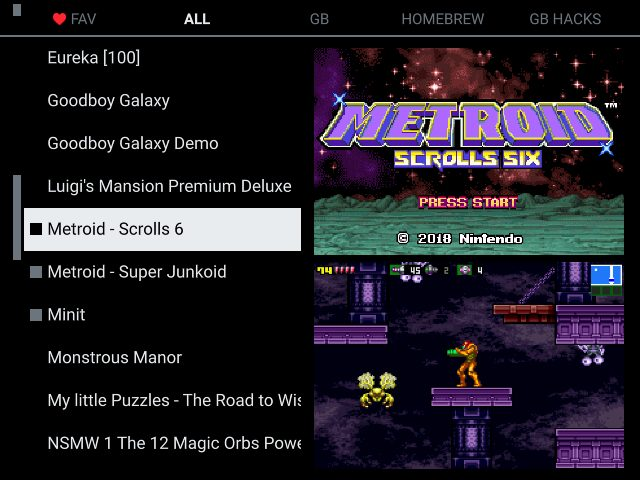
  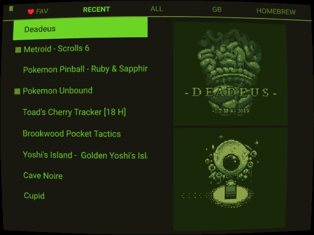
</p>

</details>

<details><summary><b>shinretro</b> (@TigraTT-Driver) — 2 张</summary>

<p>
  
  
</p>

</details>

<details><summary><b>EasyLaunch</b> (@VGmove) — 3 张</summary>

<p>
  
  
  
</p>

</details>

<details><summary><b>Minimis</b> (@waldnercharles) — 2 张</summary>

<p>
  
  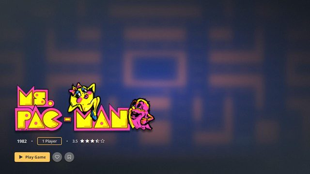
</p>

</details>

<details><summary><b>Amberline</b> (@ZagonAb) — 3 张</summary>

<p>
  
  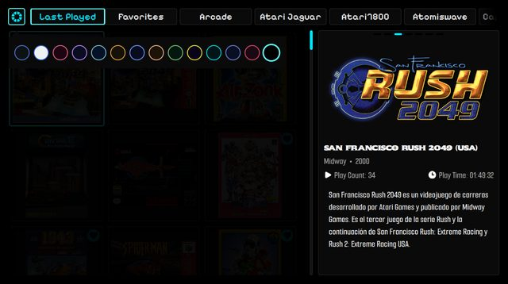
  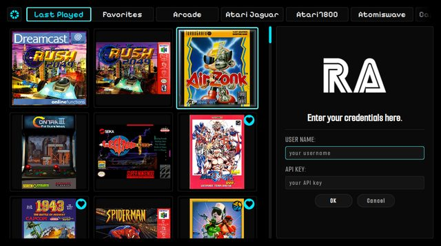
</p>

</details>

<details><summary><b>Collection Hub</b> (@ZagonAb) — 2 张</summary>

<p>
  
  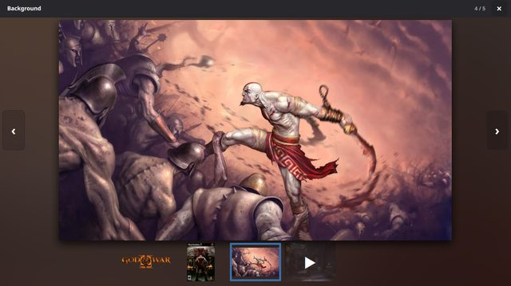
</p>

</details>

<details><summary><b>Flat Ozone</b> (@ZagonAb) — 2 张</summary>

<p>
  
  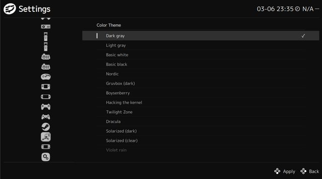
</p>

</details>

<details><summary><b>FlatFlix</b> (@ZagonAb) — 3 张</summary>

<p>
  
  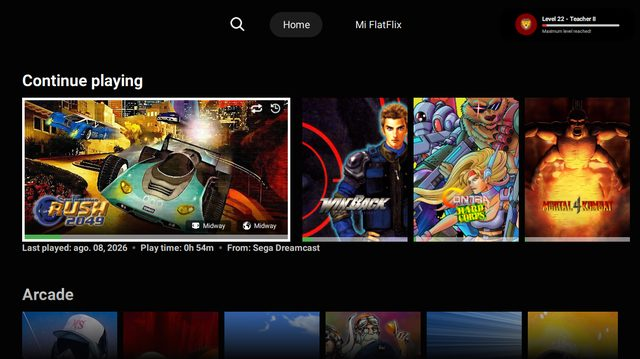
  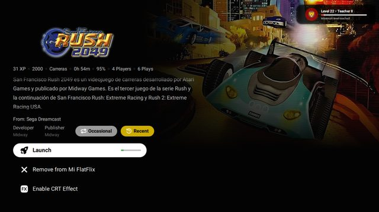
</p>

</details>

<details><summary><b>Ludens</b> (@ZagonAb) — 3 张</summary>

<p>
  
  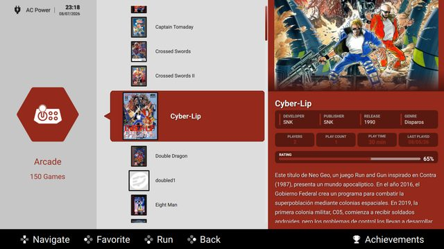
  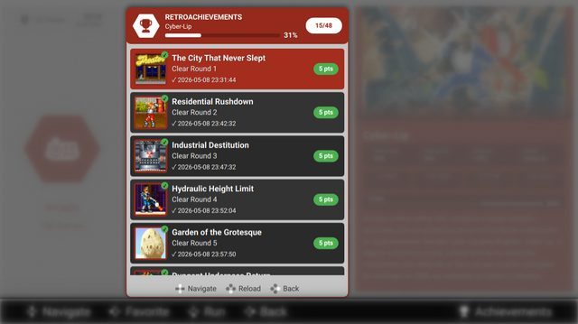
</p>

</details>

<details><summary><b>Nostalgia-Grid theme for Pegasus</b> (@ZagonAb) — 2 张</summary>

<p>
  
  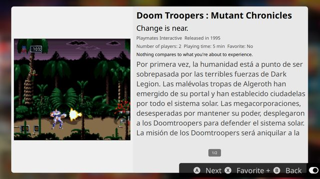
</p>

</details>

<details><summary><b>PEGASUS BEACON LITE</b> (@ZagonAb) — 3 张</summary>

<p>
  
  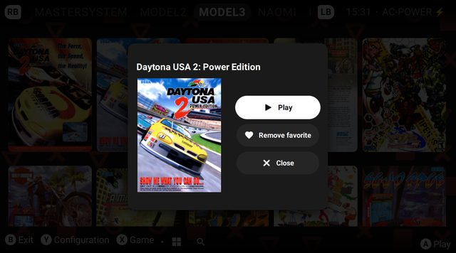
  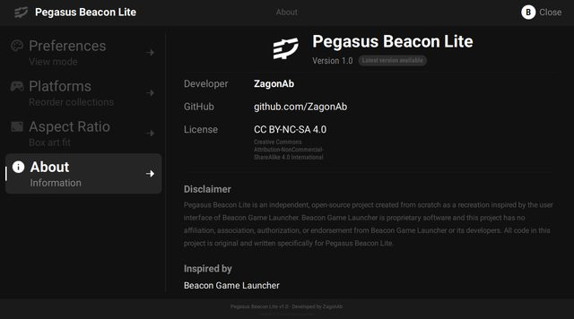
</p>

</details>

<details><summary><b>pegasus box</b> (@ZagonAb) — 2 张</summary>

<p>
  
  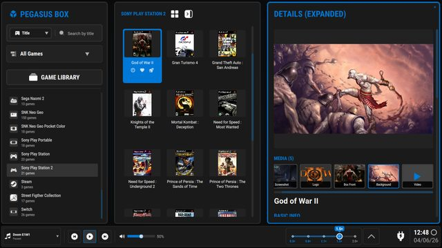
</p>

</details>

<details><summary><b>PlayHub</b> (@ZagonAb) — 2 张</summary>

<p>
  
  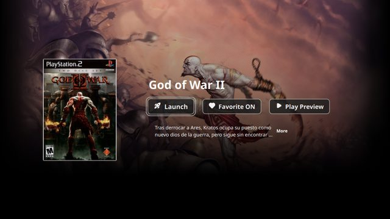
</p>

</details>

<details><summary><b>Run&Game</b> (@ZagonAb) — 2 张</summary>

<p>
  
  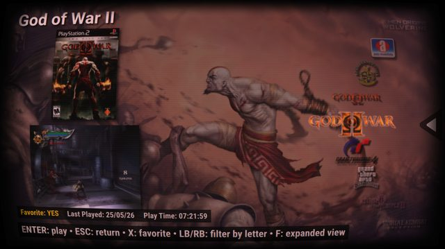
</p>

</details>

<details><summary><b>Vapour Pegasus</b> (@ZagonAb) — 2 张</summary>

<p>
  
  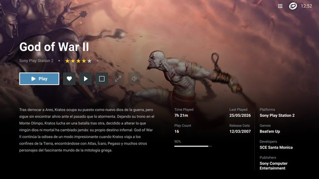
</p>

</details>

<details><summary><b>VideoGame</b> (@ZagonAb) — 3 张</summary>

<p>
  
  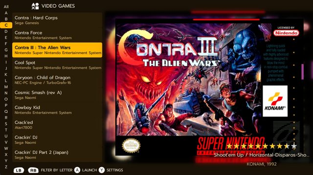
  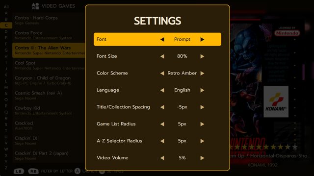
</p>

</details>

## 暂未取到截图

以下主题仓库里没有找到可直接引用的图片（欢迎提 PR 补图）：

- [ElectronicRave/ES-Simple-Clean](https://github.com/ElectronicRave/ES-Simple-Clean)
- [ElectronicRave/RP-Launcher](https://github.com/ElectronicRave/RP-Launcher)
- [rutantan/zephyr](https://github.com/rutantan/zephyr)
- [y-muller/retromega-sleipnir](https://github.com/y-muller/retromega-sleipnir)
- [ZagonAb/BigScreenFE](https://github.com/ZagonAb/BigScreenFE)
- [ZagonAb/FlixNet_Plus](https://github.com/ZagonAb/FlixNet_Plus)
- [ZagonAb/Limbo-Theme](https://github.com/ZagonAb/Limbo-Theme)

## 重新生成

```bash
pip install pillow        # 可选，用于压缩图片
python scripts/generate.py            # 增量更新
python scripts/generate.py --force    # 全量重抓
```

主题列表同步自 `data/repos.txt`（上游：mmatyas/pegasus-theme-gallery-db）。
